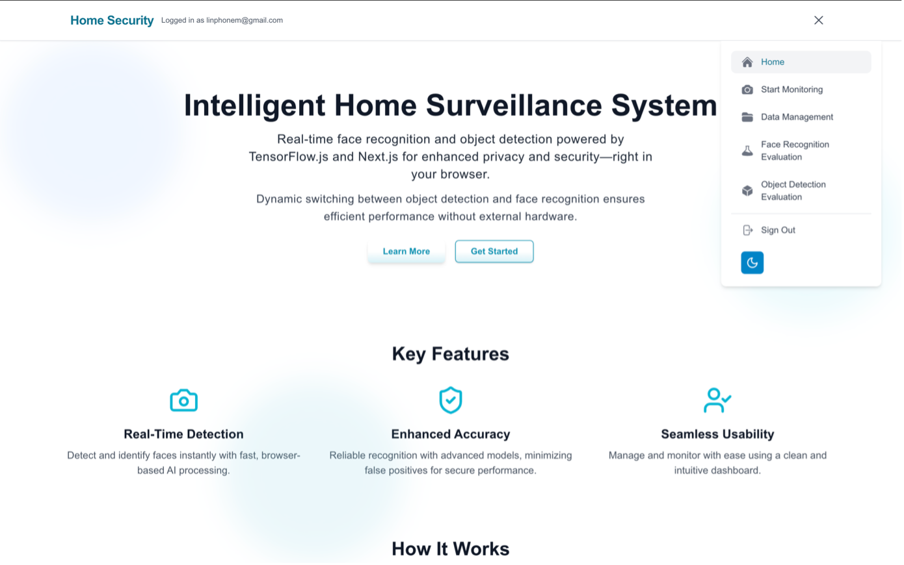
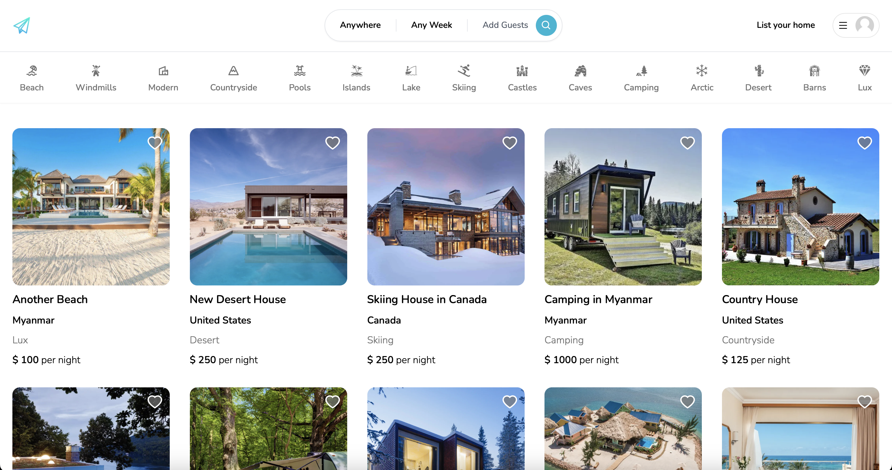
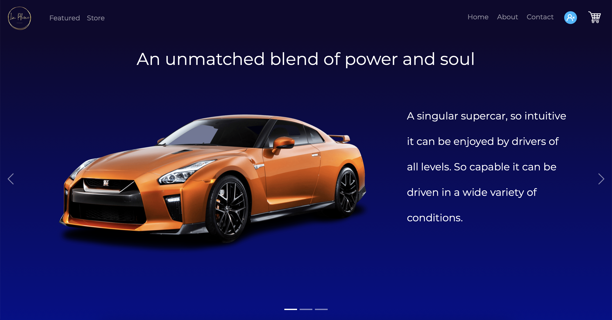

# 
👋 Hi, I'm Lin Phone Myint Zaw

  <h3>Computer Science Student at Edinburgh Napier University</h3>
  
Passionate Full-Stack Developer with AI/ML Experience

  <a href="https://lpmz-portfolio.vercel.app/">Portfolio</a> •
  <a href="mailto:linphonem@gmail.com">Email</a> •
  <a href="https://linkedin.com/in/yourprofile">LinkedIn</a> •
  

  

---

## 🛠️ Technical Skills

### Programming Languages

### Web Development

### AI/ML & Data Science

---

## 🚀 Featured Projects

<h3 align="center">My Projects</h3>

| Project | Description | Demo | Screenshot |
|---------|------------|------|------------|
| **Intelligent Home Surveillance System** | AI-powered security with facial recognition | [Live Demo](https://home-security-rho.vercel.app/) |  |
| **Pharmacy Management System** | Inventory management for pharmacies | [Live Demo](https://pms-frontend-virid.vercel.app/) |  |
| **Hotel Booking Platform** | Reservation system for hotels | [Live Demo](https://scape-booking.vercel.app/) |  |
| **Travel Scape - Rental Platform** | Peer-to-peer accommodation rental | [Live Demo](https://travelscape-next.vercel.app/) |  |
| **Rev Up Auto - E-Commerce** | Automotive parts marketplace | Coming Soon |  |

---

## 📚 Currently Learning
- Advanced Computer Vision techniques
- Cloud computing (AWS/GCP)
- Microservices architecture
- Natural Language Processing

---

## 📫 Connect With Me

  
  
  
  
  

