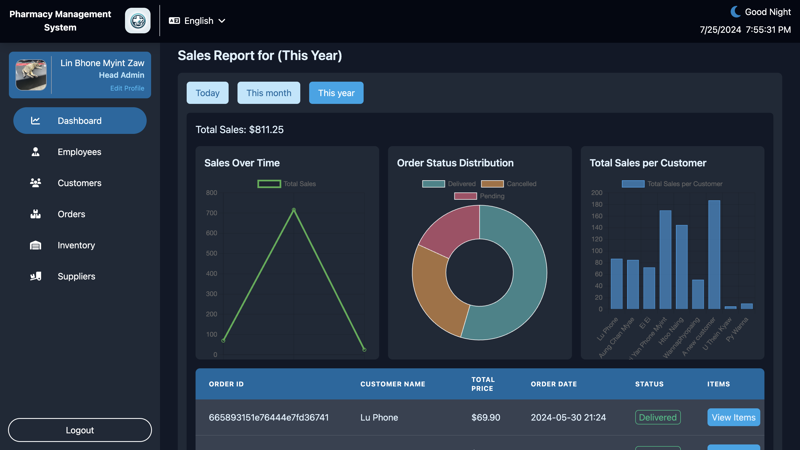
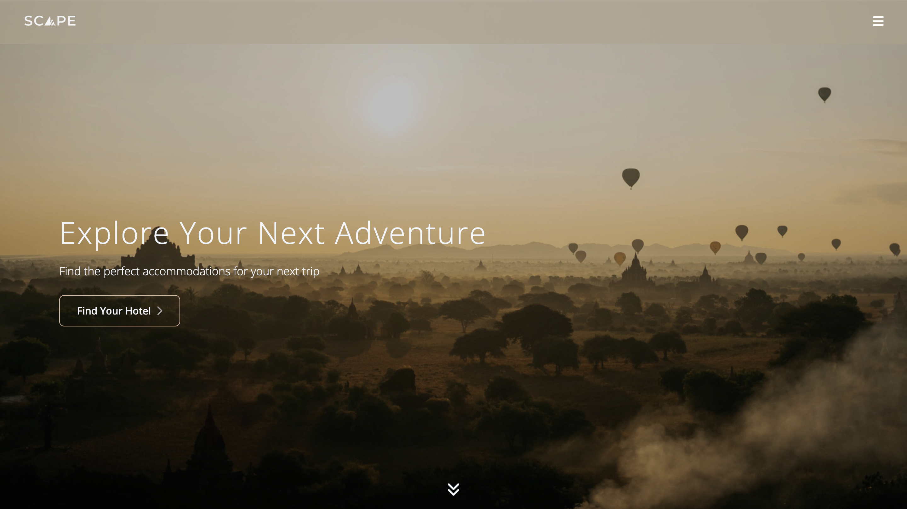

<h1 align="center">Hi, I'm Lin Phone Myint Zaw 👋</h1>
<h3 align="center">Computer Science Student at Edinburgh Napier University</h3>

  <a href="https://lpmz-portfolio.vercel.app/">Portfolio</a> •
  <a href="mailto:linphonem@gmail.com">Email</a> •
  <a href="https://linkedin.com/in/yourprofile">LinkedIn</a>

   
  

---

## 🚀 About Me

- 🔭 Currently working on enhancing my full-stack development skills
- 🌱 Learning advanced topics in AI/ML and cloud computing
- 👯 Looking to collaborate on innovative web and AI projects
- 💬 Ask me about MERN stack, Next.js, or computer vision
- 📫 How to reach me: **linphonem@gmail.com**

---

## 🔧 Technologies & Tools

### Web Development

  
  
  
  
  
  
  
  
  

### AI/ML & Data Science

  
  
  
  
  
  
  
  

### Other Technologies

  
  
  
  
  

---
    <h3 align="left">My Projects</h3>

| Project | Demo | Screenshot |
|---------|------|------------|
| **Intelligent Home Surveillance System** | [Live Demo](https://home-security-rho.vercel.app/) |  |
| **Pharmacy Management System** | [Live Demo](https://pms-frontend-virid.vercel.app/) |  |
| **Hotel Booking Platform** | [Live Demo](https://scape-booking.vercel.app/) |  |
| **Travel Scape - Rental Platform** | [Live Demo](https://travelscape-next.vercel.app/) |  |
| **Rev Up Auto - E-Commerce** | Coming Soon |  |

---

## 📞 Connect With Me

  
  
  
  
  

